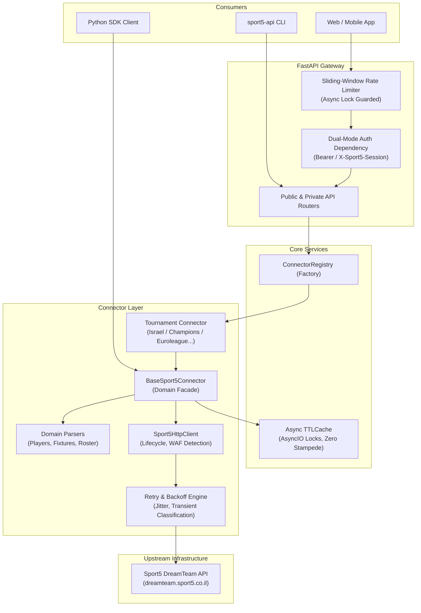

# Sport5 Fantasy API & SDK 🏆

[](https://github.com/yaronbs12/Sport5-fantasy-API/actions/workflows/ci.yml)
[](https://www.python.org/downloads/)
[](https://fastapi.tiangolo.com)
[](https://docs.pydantic.dev/)
[](https://mypy-lang.org/)
[](https://github.com/astral-sh/ruff)
[](tests/)
[](tests/)
[](LICENSE)

An open-source, production-grade **asynchronous REST API and Python SDK client** for the
[Sport5 Fantasy](https://dreamteam.sport5.co.il) ecosystem. Supports Israeli Premier League,
UEFA Champions League, Euroleague Basketball, FIFA World Cup, and UEFA Euro tournaments.

---

## ⚡ Key Features

- **🚀 Asynchronous REST API & Python SDK** — Built on FastAPI and HTTPX with 100% non-blocking async execution.
- **🔌 Multi-Tournament Connector Strategy** — Decoupled strategy pattern supporting 5 Sport5 fantasy competitions:
  - 🇮🇱 `israel` — Israeli Premier League (ליגת העל / ליגת החלומות)
  - 🏆 `champions` — UEFA Champions League Fantasy
  - 🏀 `euroleague` — Euroleague Basketball Fantasy (sport-specific rules & roster)
  - 🌍 `world-cup` — FIFA World Cup Tournament Fantasy
  - 🇪🇺 `euro` — UEFA Euro Tournament (historical archive)
- **🛡️ Resilient Networking & Exponential Backoff** — Production-ready retry loop on transient upstream failures (`502`, `503`, `504`, timeouts, connection resets) with randomized jitter (`0.05s-0.15s`) and configurable backoff caps. Strict fail-fast on auth/client errors and WAF blocks.
- **🧠 Concurrency-Safe In-Memory TTL Caching** — Non-blocking in-memory cache guarded by `asyncio.Lock` per cache key to prevent stampedes while eliminating redundant upstream calls (players: 10m, fixtures: 15m, teams: 1h, season: 24h). User squads and private data are never cached.
- **⏱️ In-Memory Sliding-Window Rate Limiting** — Thread-safe and async-safe rate limiting on sensitive endpoints (e.g. `/auth/login`) returning HTTP `429 Too Many Requests` with dynamic `Retry-After` headers.
- **🧹 Strict Pydantic V2 Boundary Normalization** — Strict type validation, sub-unit price scaling (`5_000_000` → `5.0M`), Hebrew quote sanitization (`Daniel`Tenenbaum` → `Daniel'Tenenbaum`), and dynamic `is_active` resolution (`isDeleted` / `isRemoved`).
- **🔐 Hardened Authentication & Zero-Storage** — Supports both `Authorization: Bearer <token>` and `X-Sport5-Session: <token>` headers with direct login token exchange. User credentials and raw session tokens are never stored, with masked emails in audit logs (`us***@domain.com`).
- **📦 Fully Typed (PEP 561)** — Strict static typing checked via `mypy --strict`, with `py.typed` marker for IDE autocompletion.
- **☁️ Cloud & Container Ready** — Complete Docker Compose and Infrastructure-as-Code (`render.yaml`) blueprints.

---

## 🏛️ System Architecture



---

## 📁 Architecture & Directory Layout

```text
Sport5-fantasy-API/
├── pyproject.toml                     # Packaging, dependencies, CLI scripts, and tool configs
├── docker-compose.yml                 # One-command containerized development & deployment
├── render.yaml                        # Render PaaS Infrastructure-as-Code specification
├── Dockerfile                         # Production non-root multi-stage container build
├── .env.example                       # Environment configuration template
├── LICENSE                            # MIT open-source license
├── README.md                          # Comprehensive documentation
├── scripts/
│   └── smoke_test_live.py             # Live upstream read-only verification script
├── sport5_fantasy_api/
│   ├── __init__.py                    # Public SDK imports & package entry point
│   ├── cli.py                         # CLI entry point (sport5-api command)
│   ├── py.typed                       # PEP 561 typing marker
│   ├── api/
│   │   ├── dependencies.py            # Connector resolver & session token dependency
│   │   ├── main.py                    # FastAPI factory, exception handlers, OpenAPI tags
│   │   └── routes/
│   │       ├── auth.py                # POST /{tournament}/auth/login (rate-limited)
│   │       ├── private.py             # GET /{tournament}/me/team, /me/leagues
│   │       └── public.py              # GET /tournaments, /players, /teams, /fixtures
│   ├── connectors/
│   │   ├── base.py                    # BaseSport5Connector facade
│   │   ├── http_client.py             # Sport5HttpClient: httpx lifecycle & WAF checks
│   │   ├── retry.py                   # Retry constants, backoff with jitter, classifications
│   │   ├── parsers/                   # Dedicated domain payload parsers
│   │   │   ├── players.py             # Multi-shape player payload extractor & normalizer
│   │   │   ├── fixtures.py            # Fixtures, rounds, and deadline parsing
│   │   │   └── user.py                # Roster, starters, bench, captain, leagues
│   │   ├── israeli_league.py          # Israeli Premier League connector (season 10)
│   │   ├── champions_league.py        # UEFA Champions League connector (season 12)
│   │   ├── euroleague.py              # Euroleague Basketball connector (season 11, sport=2)
│   │   ├── world_cup.py               # World Cup tournament connector (season 9)
│   │   ├── euro.py                    # Euro tournament connector (season 3, inactive)
│   │   └── registry.py                # ConnectorRegistry singleton factory
│   ├── core/
│   │   ├── cache.py                   # Async TTLCache with asyncio.Lock concurrency protection
│   │   ├── config.py                  # Pydantic-settings with environment modes & FANTASY_ prefix
│   │   ├── exceptions.py              # Domain exceptions (Sport5AuthError, UpstreamError, etc.)
│   │   └── rate_limit.py              # Thread-safe sliding-window AsyncRateLimiter
│   └── models/
│       ├── auth.py                    # LoginRequest & TokenResponse
│       ├── enums.py                   # TournamentType, Position (GK, DEF, MID, FWD), PlayerRole
│       ├── fixture.py                 # Team, RoundInfo, Match, LeagueMetaResponse
│       ├── league.py                  # LeagueSummary, LeagueMember
│       ├── player.py                  # Player model with price & active normalization
│       └── user.py                    # RosterPlayer, UserTeamResponse
└── tests/
    ├── conftest.py                    # Test fixtures (rate limiter reset, client setup)
    ├── test_api_auth_and_private.py   # Auth endpoints, Bearer token, session headers
    ├── test_api_public_routes.py      # All public routes, filters, OpenAPI metadata
    ├── test_cache_resilience.py       # TTL expiry, concurrency locks, user data isolation
    ├── test_cli.py                    # CLI argument parsing and uvicorn invocation
    ├── test_connector_resilience.py   # Exponential backoff, jitter, fail-fast behavior
    ├── test_edge_cases_models.py      # Pydantic boundary checks, date parsers, active flags
    ├── test_players_pipeline.py       # Multi-shape player payload parser & filters
    ├── test_refactored_modules.py     # Unit tests for modular HTTP, parsers, and rate limiting
    ├── test_tournament_expansion.py   # Euroleague, World Cup, Euro connectors
    └── test_waf_and_upstream_error.py # WAF HTML blocks, HTTP 502/504 translations
```

---

## 🎯 Architecture Decisions (ADR Summary)

### 1. Fully Asynchronous Architecture (`asyncio` + `httpx`)
- **Context:** Fantasy sports API consumers need high concurrency (fetching player pools, calculating gameweek statistics, tracking leaderboards).
- **Decision:** Built entirely on Python's native `asyncio` event loop using `httpx.AsyncClient` with connection pooling and FastAPI's ASGI foundation.
- **Benefit:** Non-blocking I/O allows hundreds of concurrent requests per worker with sub-millisecond CPU overhead.

### 2. Modular Connector & Strategy Pattern
- **Context:** Sport5 operates distinct tournaments (football vs basketball) with different season IDs, sport codes, and roster structures.
- **Decision:** Extracted HTTP networking, retry/backoff calculations, and domain payload parsers out of a monolithic connector into specialized single-responsibility modules:
  - `Sport5HttpClient`: Handles connection lifecycle, Chrome desktop User-Agent spoofing, and WAF fingerprint detection.
  - `RetryEngine`: Pure functional exponential backoff with full jitter.
  - `Domain Parsers`: Isolated extraction of raw payloads into Pydantic models.
  - `BaseSport5Connector`: Unified facade orchestrating client, cache, and parsers.

### 3. Concurrency-Guarded In-Memory TTL Caching
- **Context:** Public endpoints (player lists, fixture schedules) are heavily queried, but upstream servers are fragile.
- **Decision:** Developed an in-memory `TTLCache` where each cache key has an isolated `asyncio.Lock()`.
- **Benefit:** Completely eliminates the **cache stampede problem** (Thundering Herd) when a key expires under high load, while avoiding heavy Redis operational overhead for single-node deployments. User private data is explicitly bypassed and never cached.

### 4. Zero-Dependency Sliding-Window Rate Limiting
- **Context:** The upstream authentication endpoint (`POST /auth/login`) should be protected from brute-force attempts without forcing operators to provision a Redis cluster.
- **Decision:** Implemented an in-memory sliding-window log rate limiter with microsecond timestamp tracking and `asyncio.Lock` safety. Returns `429 Too Many Requests` with a precise `Retry-After` header.

### 5. Pydantic V2 Boundary Normalization
- **Context:** Sport5 upstream JSON formats contain quirks: prices represented as raw integer sub-units (`7500000`), Hebrew strings with non-standard grave accents (``Daniel`Tenenbaum``), and irregular boolean flags (`isDeleted` vs `isRemoved`).
- **Decision:** Sanitization happens immediately at the ingress boundary inside Pydantic field and model validators, keeping core domain models pristine.

---

## 🚀 Getting Started & Installation

### Option 1: Docker Compose (Recommended)

Start the production server in one command:

```bash
# Clone the repository
git clone https://github.com/yaronbs12/Sport5-fantasy-API.git
cd Sport5-fantasy-API

# Launch container with automatic build and health checks
docker compose up -d --build

# View logs
docker compose logs -f

# Check health
curl http://localhost:8000/health
```

### Option 2: Local Python Installation

```bash
git clone https://github.com/yaronbs12/Sport5-fantasy-API.git
cd Sport5-fantasy-API

# Create and activate virtual environment
python -m venv .venv
.venv\Scripts\activate        # Windows PowerShell
# source .venv/bin/activate   # Linux / macOS

# Install in editable mode with development & testing dependencies
pip install -e ".[dev]"
```

---

## 🖥️ Running the API Server via CLI

The package registers the executable `sport5-api` CLI entry point:

```bash
# Start development server with auto-reload
sport5-api --host 0.0.0.0 --port 8000 --reload
```

### CLI Arguments

| Flag | Default | Description |
|---|---|---|
| `--host` | `0.0.0.0` | Host interface to bind server to |
| `--port` | `8000` | Port to listen on |
| `--reload` | `false` | Enable live reload on code changes |

Once running, interactive documentation is immediately accessible at:
- **Interactive Swagger UI**: [http://localhost:8000/docs](http://localhost:8000/docs)
- **ReDoc Documentation**: [http://localhost:8000/redoc](http://localhost:8000/redoc)
- **OpenAPI 3.1 JSON**: [http://localhost:8000/openapi.json](http://localhost:8000/openapi.json)
- **Health Check**: [http://localhost:8000/health](http://localhost:8000/health)

---

## ☁️ Cloud Deployment

### Deploying on Render (PaaS)

This repository includes a [`render.yaml`](render.yaml) Infrastructure-as-Code blueprint for frictionless deployment:

1. Fork or push this repository to your GitHub account.
2. Sign in to [Render](https://render.com) and navigate to **Blueprints**.
3. Connect your repository — Render will automatically detect `render.yaml`.
4. Set your environment variables (or accept the production defaults).
5. Click **Apply** to deploy the Dockerized web service.

---

## 💡 Code Examples

### Example 1: Direct Python SDK Client

Interact with Sport5 upstream directly without running the HTTP server:

```python
import asyncio
from sport5_fantasy_api import IsraeliLeagueConnector, Position


async def main() -> None:
    # Context manager automatically handles client teardown
    async with IsraeliLeagueConnector() as connector:
        # 1. Discover current active season ID
        season_id = await connector.discover_season_id()
        print(f"Current Season ID: {season_id}")

        # 2. Fetch all fantasy players (cached for 10 minutes)
        players = await connector.get_all_players()
        print(f"Total players in pool: {len(players)}")

        # 3. Filter active forwards priced <= 9.0M
        budget_fwds = [
            p
            for p in players
            if p.is_active and p.position == Position.FWD and p.price <= 9.0
        ]
        for p in budget_fwds[:5]:
            print(f"[{p.team_name}] {p.name} - {p.price}M (Points: {p.total_points})")

        # 4. Fetch upcoming round fixtures and deadline
        fixtures = await connector.get_fixtures()
        print(f"Next Gameweek Deadline: {fixtures.exchange_deadline}")


if __name__ == "__main__":
    asyncio.run(main())
```

---

### Example 2: Consuming the REST API

Query public endpoints with price, position, team, and active filters:

#### Using `curl`:
```bash
# Query active midfielders in Israeli League under 8.5M
curl -X GET "http://localhost:8000/api/v1/israel/players?position=MID&max_price=8.5&include_inactive=false"
```

#### Using Python `httpx`:
```python
import httpx

with httpx.Client(base_url="http://localhost:8000/api/v1") as client:
    # Get tournament directory
    tournaments = client.get("/tournaments").json()
    print("Available Tournaments:", [t["name"] for t in tournaments])

    # Fetch club teams with logo URLs
    teams = client.get("/israel/teams").json()
    for team in teams[:3]:
        print(f"Team: {team['name']} (Logo: {team['teamLogoPath']})")
```

---

### Example 3: Authenticated Session & Squad Management

Authenticate with Sport5 credentials to manage user squads and private leagues:

```python
import httpx

BASE_URL = "http://localhost:8000/api/v1/israel"

with httpx.Client() as client:
    # 1. Login to Sport5 and acquire .AspNetCore.Cookies session token
    login_resp = client.post(
        f"{BASE_URL}/auth/login",
        json={"email": "user@example.com", "password": "my_secret_password"},
    )
    token_data = login_resp.json()
    token = token_data["access_token"]
    print("Acquired Session Token successfully.")

    # 2. Query private user team using Bearer token
    headers = {"Authorization": f"Bearer {token}"}
    squad_resp = client.get(f"{BASE_URL}/me/team", headers=headers)
    squad = squad_resp.json()

    print(f"User: {squad['user_name']} | Team: {squad['team_name']}")
    print(f"Budget Remaining: {squad['budget_remaining']}M")
    print(f"Captain: {squad['captain']['name'] if squad['captain'] else 'None'}")
    print(f"Starters Count: {len(squad['starters'])} (Bench: {len(squad['bench'])})")

    # 3. Query user's private mini-leagues
    leagues_resp = client.get(f"{BASE_URL}/me/leagues", headers=headers)
    for league in leagues_resp.json():
        print(f"League: {league['name']} | Members: {league['member_count']}")
```

---

## ⚙️ Environment Configuration

All settings can be customized via `.env` or system environment variables:

| Variable | Default | Description |
|---|---|---|
| `FANTASY_ENVIRONMENT` | `development` | Environment mode (`development`, `staging`, `production`, `test`) |
| `FANTASY_DEBUG` | `false` | Enable FastAPI debug mode |
| `FANTASY_CORS_ORIGINS` | `*` | Allowed CORS origins (comma-separated; restricted in production) |
| `FANTASY_RATE_LIMIT_ENABLED` | `true` | Enable rate limiting on sensitive routes |
| `FANTASY_RATE_LIMIT_LOGIN_REQUESTS` | `10` | Maximum login attempts allowed per window |
| `FANTASY_RATE_LIMIT_LOGIN_WINDOW_SECONDS` | `60` | Sliding window duration in seconds for login attempts |
| `FANTASY_HTTP_TIMEOUT_SECONDS` | `15.0` | Timeout in seconds for upstream HTTP requests |
| `FANTASY_HTTP_MAX_RETRIES` | `3` | Maximum automatic retries on transient errors |
| `FANTASY_CACHE_TTL_PLAYERS` | `600` | Player pool cache TTL in seconds (10m) |
| `FANTASY_CACHE_TTL_FIXTURES` | `900` | Fixture metadata cache TTL in seconds (15m) |
| `FANTASY_CACHE_TTL_TEAMS` | `3600` | Team directory cache TTL in seconds (1h) |
| `FANTASY_CACHE_TTL_SEASON_DISCOVERY` | `86400` | Season discovery cache TTL in seconds (24h) |

---

## 🔒 Security Policy & Practices

- **Zero Credential Storage:** The server operates in a strictly stateless proxy fashion for authentication. User passwords and raw `.AspNetCore.Cookies` tokens are never logged or persisted to disk/database.
- **Audit Log Masking:** All authentication log entries redact sensitive user identifiers (e.g. `us***@domain.com`).
- **Brute-Force Mitigation:** Sliding-window rate limiters actively reject high-frequency authentication traffic per IP address.
- **Least-Privilege Containers:** Docker images run on a dedicated unprivileged system user (`appuser:10001`).
- **Production CORS Restrictions:** In `production` environment mode, CORS disallows credential transmission when configured with a wildcard (`*`) origin.
- **Vulnerability Reporting:** To report a security vulnerability, please open a confidential Security Advisory on GitHub rather than a public issue.

---

## ⚠️ Known Limitations & Upstream Reality

1. **Reverse-Engineered Protocol:** Upstream Sport5 API endpoints are undocumented and subject to unannounced schema or authentication changes by RGE Media.
2. **In-Memory State:** Caching and rate limiting run in-process on the active event loop. If horizontally scaled across multiple instances behind a load balancer without sticky sessions, rate limits and caches will be node-local unless paired with a centralized cache.
3. **DataDome / Cloudflare WAF:** While `Sport5HttpClient` emulates modern browser fingerprints, aggressive high-volume traffic directly from datacenter IP addresses may trigger upstream bot challenges.

---

## 🧪 Testing & Quality Assurance

The project maintains **100% passing tests (173 tests)** with strict typing and coverage:

```bash
# Run complete test suite with coverage report
pytest --cov=sport5_fantasy_api --cov-report=term-missing

# Run strict static type checking
mypy sport5_fantasy_api

# Run linter and code style enforcement
ruff check .
ruff format --check .

# Run live smoke test against upstream Sport5 servers
python scripts/smoke_test_live.py
```

---

## 🛡️ Upstream Error Handling Matrix

| HTTP Status | Domain Exception | Upstream Trigger |
|---|---|---|
| `401 Unauthorized` | `Sport5AuthError` | Expired / invalid `.AspNetCore.Cookies` session token |
| `404 Not Found` | `HTTPException` | Unknown player ID or unsupported tournament slug |
| `429 Too Many Requests` | `HTTPException` | Local sliding-window rate limit exceeded on `/auth/login` |
| `502 Bad Gateway` | `Sport5WAFBlockError` | Upstream returned DataDome HTML challenge block |
| `502 Bad Gateway` | `Sport5UpstreamError` | Upstream returned HTTP 502/503/504 (after retries) |
| `502 Bad Gateway` | `Sport5DataError` | Upstream JSON structure payload changed unexpectedly |
| `500 Server Error` | `Exception` | Unhandled internal error |

---

## 📄 License

Distributed under the **MIT License**. See [LICENSE](LICENSE) for details.

---

## ⚠️ Disclaimer

This project is an unofficial, reverse-engineered client for the Sport5 Fantasy platform.
It is not affiliated with, endorsed by, or officially supported by Sport5 (ערוץ הספורט),
RGE Media Group, or Keshet. Use responsibly and in accordance with upstream terms of service.
